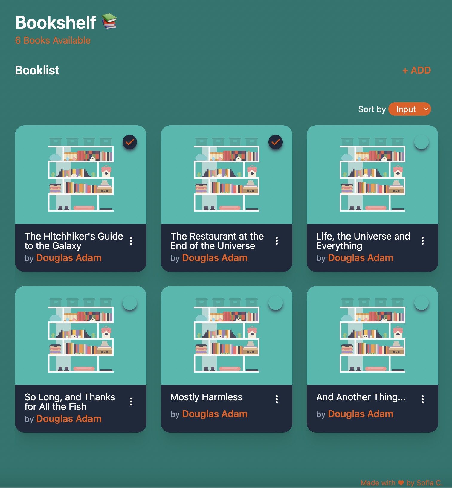

# 📚 Bookshelf App

Bookshelf is a simple application built with **React** that allows you to manage your personal library. You can add new books, edit and delete them, filter your collection, and mark books ad read. The app also supports **localStorage** to persist your library even after closing the app.

---
➡️ Try it [here](https://mybookshelfy.netlify.app/){:target="_blank"} ⬅️

---

## Features

- **Add Books**: Enter the title and author to add a new book to your library.
- **Edit Books**: Update the details of an existing book by clicking the edit button.
- **Delete Books**: Remove books from your collection with a simple click.
- **Filter Books**: Filter books by input, alphabetically or by status.
- **Mark as Read**: Keep track of books you've read by marking them with a status indicator.
- **Responsive Design**: The app adapts to various screen sizes, in order to provide a great ux.
- **LocalStorage Integration**: Your library is automatically saved in the browser's `localStorage`, so your collection persists even after refreshing or closing the browser.

## Tech Stack

- **React** for building the ui
- **Tailwind** for styling
- **Local Storage** for data persistency

## Preview

